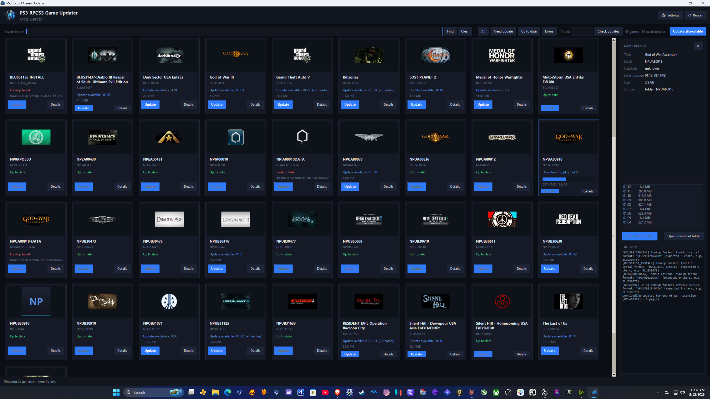
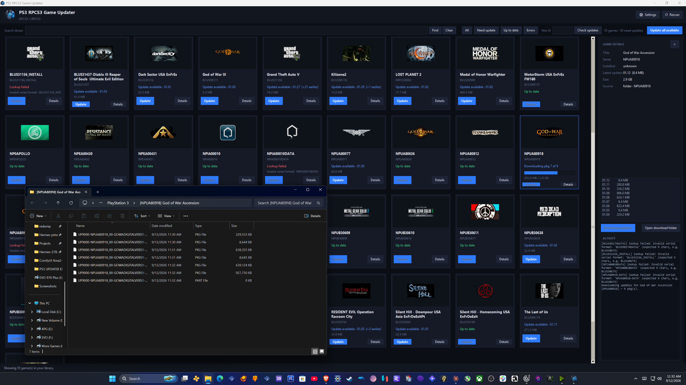
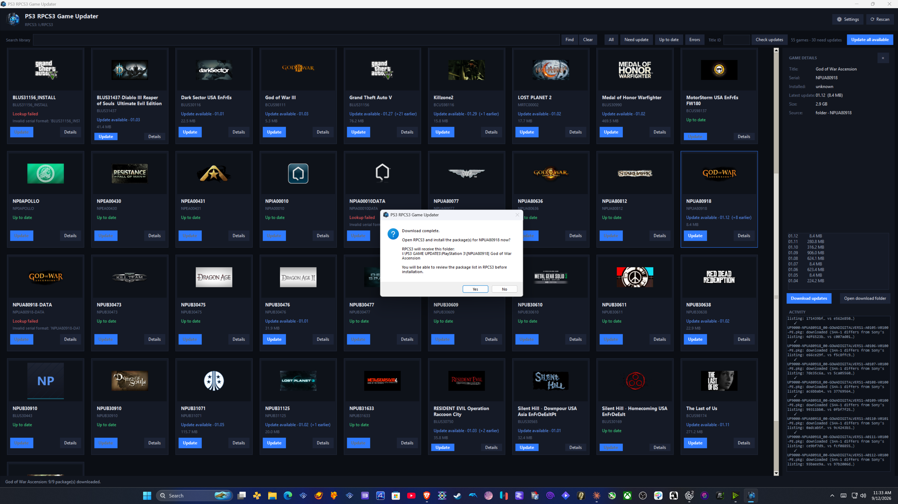
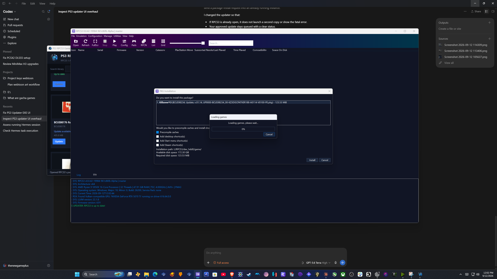
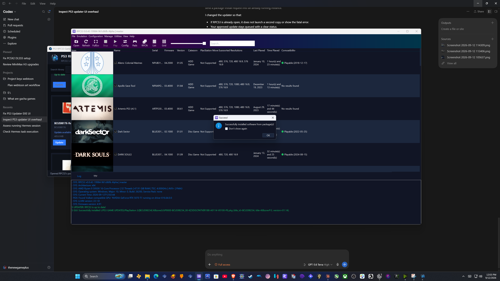

# PS3 RPCS3 Game Updater v2

[](https://github.com/Johnzx07/ps3-rpcs3-game-updater/releases)

**PS3 RPCS3 Game Updater** is a Windows app that finds, downloads, verifies, and hands off official PS3 title-update packages for games in an RPCS3 library. Version 2 replaces the original table-style app with a focused game-library interface and a safer RPCS3 install handoff.

It does not need a PlayStation account, modify game content, or bypass DRM. Use it only with games you legally own.

## Download v2

Download **`ps3-rpcs3-game-updater.exe`** from the [v2.0.0 release](https://github.com/Johnzx07/ps3-rpcs3-game-updater/releases/tag/v2.0.0), then double-click it. The build is self-contained; Windows may show a SmartScreen notice because this is an unsigned community application.

The release also includes `SHA256SUMS.txt`. The v2.0.0 executable SHA-256 is `7f89b74481480c296c3eb546d77430bebebe0dfc0a7536a0534c363a65162ced`.

## What is new in v2

- Compact cover-art game cards with clear update state and download progress.
- Search the local library by either a game title or title ID.
- Look up any exact nine-character title ID, including games not already in the library.
- Click a game or **Details** to open an information sidebar with installed version, available updates, sizes, downloads, and activity.
- Open the exact download folder for a game’s `.pkg` files.
- Confirmed RPCS3 handoff after downloading. The app keeps the package list in order and opens RPCS3’s native installer.
- Safe single-instance behavior: if RPCS3 is already open, the install is queued and launches automatically after it closes rather than creating a second-instance error.
- Packaged-launch protection so RPCS3 uses its own Microsoft Visual C++ runtime instead of the updater’s temporary runtime folder.

## How it works

1. **Choose RPCS3.** Open **Settings** and select the folder containing `rpcs3.exe`. The app scans `config\games.yml` and `dev_hdd0\game` to build your library.
2. **Find a game.** Use **Search library** for a local title or serial, or enter an exact serial such as `BLUS30675` under **Title ID** and choose **Check updates**.
3. **Review the sidebar.** Click a card or **Details**. The sidebar shows the game, every available update, package sizes, and download activity.
4. **Download in order.** Choose **Update** on a game or **Update all available**. Packages are saved in a separate game folder and verified against Sony’s listed SHA-1 values.
5. **Open the files or install.** Use **Open download folder** to inspect the PKGs. After a successful download, choose **Yes** to send that game’s package folder to RPCS3.
6. **Let RPCS3 finish.** If RPCS3 is already open, the updater waits for it to close and then starts one installer instance. When RPCS3 starts fresh, it may finish scanning its library before it displays its own package-review window. Review the list and choose **Install** in RPCS3.

Downloaded packages are organized like this:

```text
PlayStation 3/
└── [TITLE-ID] Game Name/
    ├── update-01.pkg
    └── update-02.pkg
```

## v2 walkthrough

### Browse, search, and inspect updates

The new library view keeps games compact while the selected game’s update list and activity remain visible in the sidebar.



### Inspect downloaded PKGs

The sidebar’s **Open download folder** button opens the per-game folder, so users can see the PKGs before installation.



### Confirm the RPCS3 handoff

The updater asks for confirmation after downloads complete. It never starts an install without that confirmation.



### Native RPCS3 review and install

RPCS3 owns the final review and install screens. A new RPCS3 session may briefly show its library scan before the package dialog is available.



After confirmation in RPCS3, it reports the completed package installation.



## Run from source

```powershell
git clone https://github.com/Johnzx07/ps3-rpcs3-game-updater.git
cd ps3-rpcs3-game-updater
python -m pip install -r requirements.txt
python gui_app.py
```

`Start PS3 RPCS3 Game Updater.bat` prefers the packaged executable and falls back to the source interface.

## Build v2

```powershell
python -m pip install pyinstaller
python -m PyInstaller --noconfirm ps3-rpcs3-game-updater.spec
```

The executable is written to `dist\ps3-rpcs3-game-updater.exe`. See [BUILD_EXE.md](BUILD_EXE.md) for build checks.

## Security and update sources

The app uses Sony’s public PS3 update metadata and package endpoints. It checks downloaded package SHA-1 values supplied by that metadata, and RPCS3 validates packages when installing them. Sony’s legacy endpoint certificate behavior is documented in [SECURITY.md](SECURITY.md).

## License

MIT — see [LICENSE](LICENSE).
